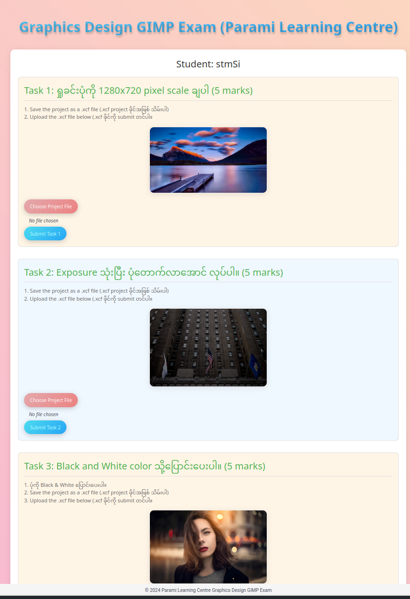

# Quick Prototype project for students to submit their exam answers

## Pre-requisites
- Rust Toolchain (https://rustup.rs/)
- SurrealDB 1.x (https://github.com/surrealdb/surrealdb/releases/tag/v1.5.5) (Incompatiable with latest 2.x)
  - Or use the linux binary that comes with this repo..

## Running the project
1. Clone the repository
2. Run SurrealDB with the following command:
    - `./surreal start -A --user root --pass root file:surrealdb.db`
3. Run `cargo run` to startup the service.

4. Should be access via http://localhost:8888

